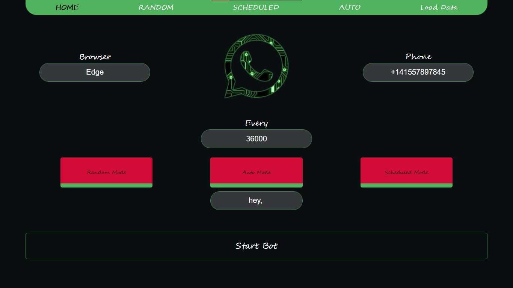
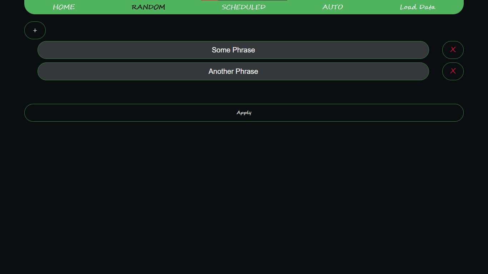
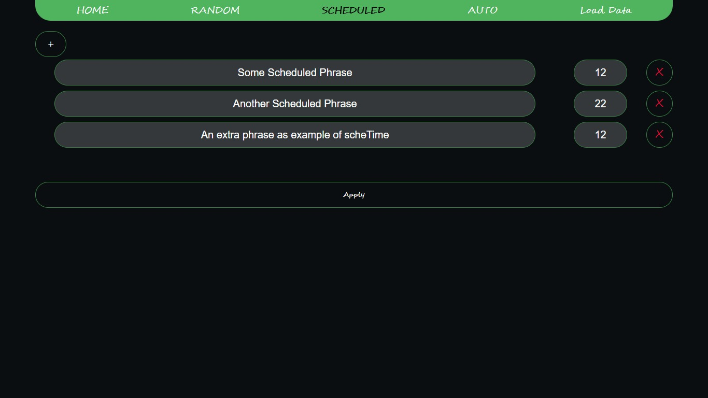
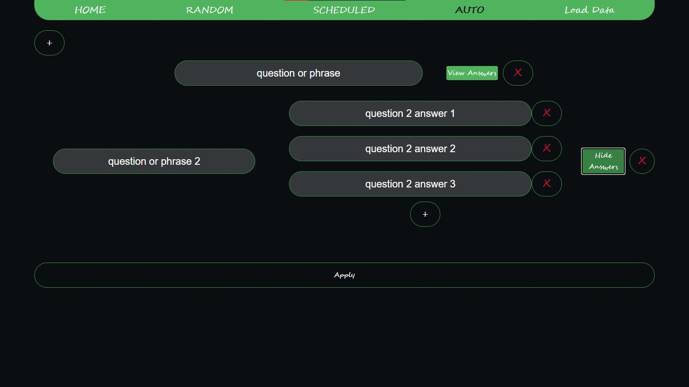

# WhatsApp Bot

#### News
> ***20/01/2022*** [ ! ] UPDATE [ ! ]
> * README.md updated
> * I will be making some little but important changes, so the bot may not work until I am done

## Indexs

1. [Introduction](#introduction)
   - [Compatibility](#compatibility)
2. [Usage](#usage)
   - [With UI](#with-ui)
   - [Without UI](#without-ui)
     - [Python Files](#python)
     - [JavaScript Files](#javascript)
3. [Contributions](#about-contributions)
4. [Contact](#contact)

## Introduction

A WhatsApp bot developed with:

- Python and JavaScript (bot)
- Python, HTML, CSS and JavaScript (UI with eel library)

I made it for **personal purposes** but modified some things to make it available to _anyone_ looking for a whatsapp bot that really _works well_.

Why did I do it? Well... Because I moved to the other side of the world leaving my life partner behind, so until we can meet again I have to find ways to keep the flame alive :D

After having a lot of headaches with bots from other developers, I realized that it was easier to do it myself (with some libraries of course) than to deal with other people's bugs. So I started this project with the idea of making a bot that is not intrusive for the user and that can stay active without any problem, eventually I realized that **doing it only with python was not going to give me what I wanted** so... I looked for a way to include a language that I'm still getting familiar with, **JavaScript**. Using selenium I was able to inject the javascript code into whatsapp web without having to do it manually.

### Compatibility

**_Only Available on Windows_**

For now, this bot is compatible with the following browsers:

- Google Chrome
- Microsoft Edge
- Mozilla Firefox

## Usage

This bot can be used in two ways:

1. [With User Interface](#with-user-interface)
2. [Without User Interface](#without-user-interface)

The UI is enabled by default, but if you want to change it just change the value of `UIstatus` from `True` to `False` in _main.py_.

### With User Interface

This UI is very simple and it doesn't require a complex explanation, if you have any doubt/issue or may be ideas to improve it, do not hesitate to send me an email or report it.

_Home Tab_

> Here you should be able to setup the target, browser, time between messages, keyword for auto mode, turn on/off any mode abd finally _start the bot_.

>>> I don't know if it is my imagination, but this tab is like a robot's face.

_Random Tab_

> Here you should be able to add and delete phrases to send randomly

_Scheduled Tab_

> Here you should be able to add and delete scheduled messages and the time preferred

_Automatic Tab_

> Here you should be able to add and delete any ask and answer

### Without User Interface

You just have to focus on two files:

1. [Python file](#python-file) called "driverConfig.py"
2. Javascript file called "config.js" located in the "config" folder

#### Python File

> ./driverConfig.py

1. Change the value of `selectedBrowser` to your preferred browser.

		selectedBrowser = "Edge"

2. Change the value of `manualPhone` to the target's phone number including its area code.

		manualPhone = "+141557897845"

#### Javascript File

> ./config/config.js

This bot has three modes:

- [Random Messages](#random-messages)
- [Scheduled Messages](#scheduled-messages)
- [Automatic Messages](#automatic-messages)

> You can keep all the modes activated

##### _Random Messages_

This mode aim to select a random message from a list and send it to your target, the time between messages can be selected changing `everyS` value. _If you decide to activate scheduled messages too, then the maximum of time is an hour (3600000 ms) between messages_

	const everyS = 3600000 // Send messages every hour
	
	const phrases = [
		"Some phrase",
		"Another phrase"
	]

##### _Scheduled Messages_

This mode aim to send messages at your preferred time, from 0 to 23.

	const schePhrases = [
		{
			phrase: "Some Scheduled Phrase", // the message
			time: 12 // your preferred time, in this case 12pm
		},
		{
			phrase: "Another Scheduled Phrase"
			time: 22
		},
		{
			phrase: "An extra phrase as example of scheTime",
			time: 12
		}
	]

	const scheTime = [12, 22] // it should have all the time values without repeated numbers.

> * Note-1: It doesn't matters if you put several messages at the same time, It will send them together.

##### _Automatic Messages_

This mode aim to answer messages from the traget, you'll be able to change the `keyWord` to read the message. This is a new feature that that I would love to improve it through the time.

	const keyWord = "hey, "; // the bot should read the message and answer only if it has this keyword
	
	const chats = [
		{
			ask: "question or phrase",
			answers: [	// it could have several answers
				"question 1 answer 1",
				"question 1 answer 2",
				"question 1 answer 3"
			]
		},
		{
			ask: "question or phrase 2",
			answers: [ // or only one but inside an array
				"question 2 answer 1"
			]
		}
	];

## About Collaborations

It's my first "bot" so I know there might be people who find bugs in it or manny ways to improve it, so if you want to give me some feedback or contribute to the project that would be great! :D

Also, English is not my first language, so I'd love if you could let me know if there are any grammatical errors.

## Contact

Don't be shy and contact me if you have any doubt or issue :D 

**Email**: _fcanalejo2000@outlook.com_ \
**Discord**: _FragnaroK#1636_